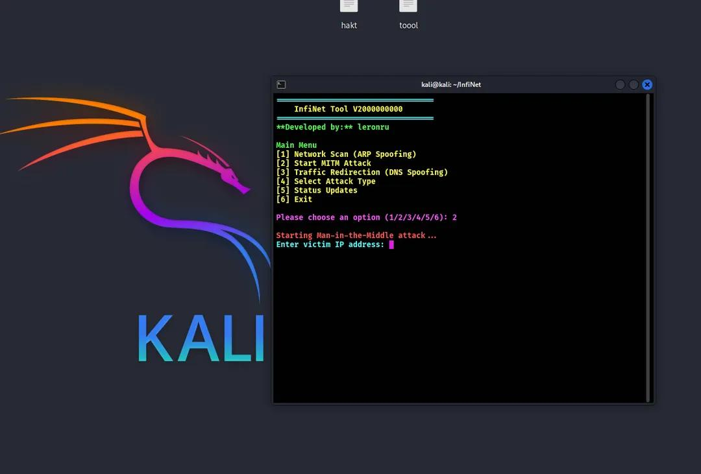

<<<<<<< HEAD
# InfiNet
InfiNet is a powerful network penetration testing tool with an advanced terminal UI, MITM attack capabilities, and automated reporting. 🚀 For educational purposes only.

InfiNet - Unlimited Internet (MITM)

📌 Overview

InfiNet is an advanced network penetration testing tool designed for educational and research purposes. This tool provides a user-friendly terminal interface with powerful automation and detailed reporting features.

🚀 Features:

Man-in-the-Middle (MITM) attack capabilities

Automatic packet interception and analysis

Real-time data logging and reporting

Advanced and stylish terminal-based UI

Multi-threaded performance for efficiency

Compatibility with Termux and Linux


⚠️ Disclaimer: This tool is for educational purposes only. Unauthorized usage is illegal.


---

🔧 Installation

1️⃣ Install dependencies:
```bash
pkg update && pkg upgrade -y
pkg install git python -y
pip install scapy termcolor
```
2️⃣ Clone the repository:
```
git clone https://github.com/leronru/InfiNet.git
```
```bash
cd InfiNet
```
3️⃣ Run the tool:
```bash
python interface.py
```

---

📜 Legal & Ethical Notice

Warning: This tool is intended for authorized security testing only. Any misuse, unauthorized access, or malicious activity is strictly prohibited and may result in legal consequences.

By using InfiNet, you agree that the developer (leron) is not responsible for any misuse.

© 2025 leronru. All Rights Reserved.

=======
# InfiNet - Unlimited Internet Tool (MITM Attack & Network Manipulation)
**Developed by:** leronru

### Description
InfiNet is a powerful network manipulation tool that enables you to conduct MITM (Man-in-the-Middle) attacks, intercept network traffic, and manipulate communications. This tool is designed to perform network analysis and testing for cybersecurity professionals.

### Features:
- MITM Attacks
- ARP Spoofing
- Sniffing Network Traffic
- Manipulating Sessions
- Customizable Attack Settings

### Prerequisites
- Python 3.x
- scapy
- colorama

### Installation
1. Clone the repository:
   ```bash
   git clone https://github.com/leronru/InfiNet.git
egal Disclaimer
```bash
2. Install dependencies:
```
```bash
pip install -r requirements.txt
```

Usage

1. Run the tool:
```bash
python infinet.py
```

2. Follow the on-screen instructions to choose the attack type and target.


##MIT License

Copyright (c) 2025 leronru

Permission is hereby granted, free of charge, to any person obtaining a copy
of this software and associated documentation files (the "Software"), to deal
in the Software without restriction, including without limitation the rights
to use, copy, modify, merge, publish, distribute, sublicense, and/or sell
copies of the Software, and to permit persons to whom the Software is
furnished to do so, subject to the following conditions:

The above copyright notice and this permission notice shall be included in all
copies or substantial portions of the Software.

THE SOFTWARE IS PROVIDED "AS IS", WITHOUT WARRANTY OF ANY KIND, EXPRESS OR
IMPLIED, INCLUDING BUT NOT LIMITED TO THE WARRANTIES OF MERCHANTABILITY,
FITNESS FOR A PARTICULAR PURPOSE AND NONINFRINGEMENT. IN NO EVENT SHALL THE
AUTHORS OR COPYRIGHT HOLDERS BE LIABLE FOR ANY CLAIM, DAMAGES OR OTHER
LIABILITY, WHETHER IN AN ACTION OF CONTRACT, TORT OR OTHERWISE, ARISING FROM,
OUT OF OR IN CONNECTION WITH THE SOFTWARE OR THE USE OR OTHER DEALINGS IN THE
SOFTWARE.

---

### **Legal Disclaimer**
This tool is intended for **educational purposes only** and should only be used in environments where **explicit permission** has been granted. Unauthorized use of this tool to intercept, manipulate, or disrupt network traffic may violate **local, national, or international laws**. The developer (leron) is not responsible for any misuse of this tool.
>>>>>>> ac6cb52 (Initial commit: InfiNet v1.0)
